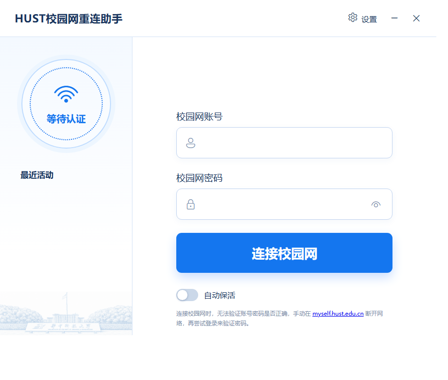

# HUST 校园网重连助手

面向华中科技大学校园网的桌面认证与自动保活工具。程序会定时检查连通性；认证失效时自动尝试重新登录。



## 功能

- 在首页填写校园网账号和密码，一键连接校园网。
- 自动获取当前网络下发的认证参数，不需要手填认证服务器地址、运营商或探针 URL。
- 自动保活：按设定间隔检查网络，掉线时按设定次数与间隔重试。
- 设置开机自启动；关闭窗口后程序会最小化到系统托盘并继续保活。
- 使用真实的网络状态和最近活动记录，便于排查认证失败原因。

## 快速开始

```bash
# 1. 安装依赖
pip install -r requirements.txt

# 2. 创建本地配置（首次运行时也会自动生成）
copy config.example.ini config.ini   # Windows

# 3. 运行
python webview_app.py
```

> `config.ini` 包含账号密码，已被 Git 忽略，请勿提交或分享该文件。

## 使用方式

1. 在首页输入校园网账号和密码，点击“连接校园网”。
2. 打开右上角“设置”，按需调整检查间隔、失败重试次数、重试间隔和开机自启动。
3. 打开“自动保活”后，窗口关闭会隐藏到托盘；在托盘菜单中可显示窗口、手动检查或彻底退出。

### 验证密码

已连接校园网时，校园网服务通常不会再次验证账号密码。若要验证密码，请手动前往 [myself.hust.edu.cn](https://myself.hust.edu.cn/) 断开网络，再回到程序尝试登录。

## 配置

通常只需在界面中修改保活相关配置。`config.ini` 的可调项如下：

| 配置项 | 默认值 | 说明 |
|---|---:|---|
| `check.interval_minutes` | `10` | 网络检查间隔（分钟） |
| `check.max_retries` | `3` | 单次检查失败后的重试次数 |
| `check.retry_delay` | `5` | 重试间隔（秒） |

## 项目结构

| 文件 | 说明 |
|---|---|
| `webview_app.py` | 桌面窗口、系统托盘与前后端桥接 |
| `hust_login.py` | 校园网认证、动态参数获取与保活核心逻辑 |
| `webview_index.html` | 登录与设置界面 |
| `assets/hust-main-gate-lineart.png` | 首页左侧的华科正门校名石线稿背景 |
| `config.example.ini` | 本地配置模板 |

## 常见问题

- **点 X 后程序仍在运行**：这是预期行为，程序已最小化到托盘，保活继续运行；请从托盘菜单选择“退出”以完全关闭。
- **账号密码无误但登录失败**：查看首页“最近活动”中的服务器返回信息；网络已连接时需先在自助服务中断网后重新验证。
- **开机自启动不生效**：在设置中切换一次“开机自启动”，然后重新登录 Windows 验证。

## 免责声明

仅供个人校园网自动认证使用。请使用自己的校园网账号，并遵守学校网络使用规定。
